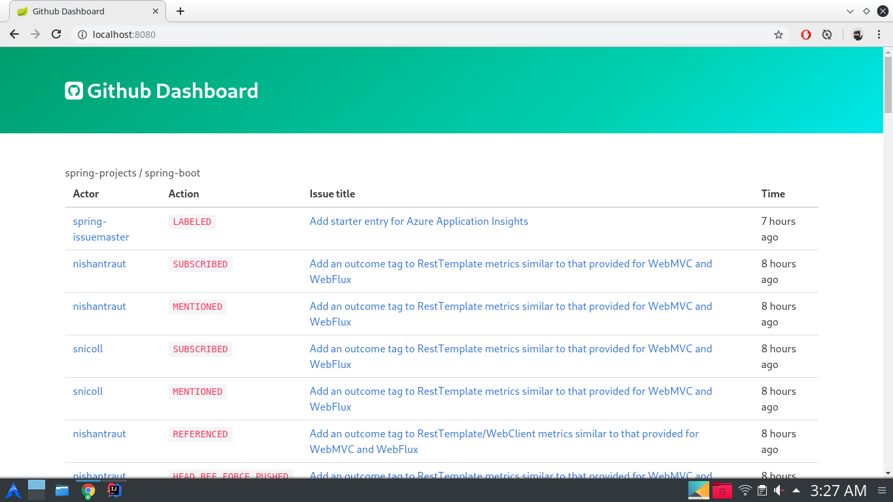
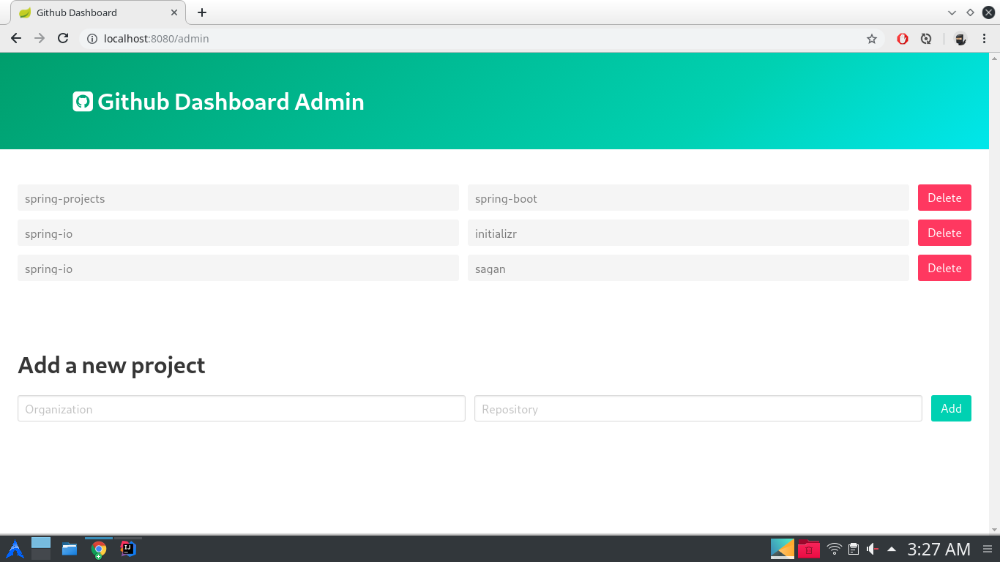
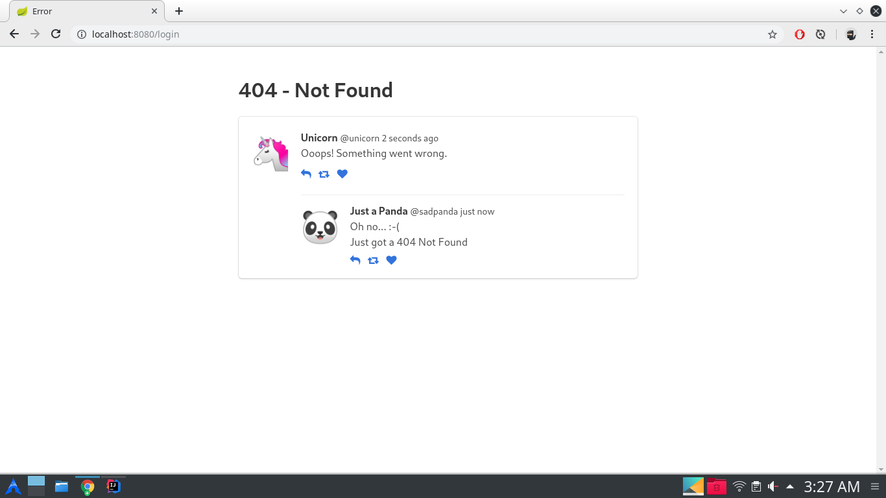

# Issues Dashboard

A simple Github Issues Dashboard, made by following an extensive tutorial on **YouTube** by official **Spring Developers** channel.

### Paths
- **Dashboard** `localhost:port/`
- **Admin** `localhost:port/admin -username admin -password -admin`

### Dashboard

### Admin Panel

### Error Page

